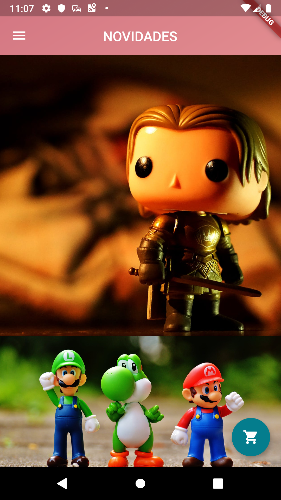
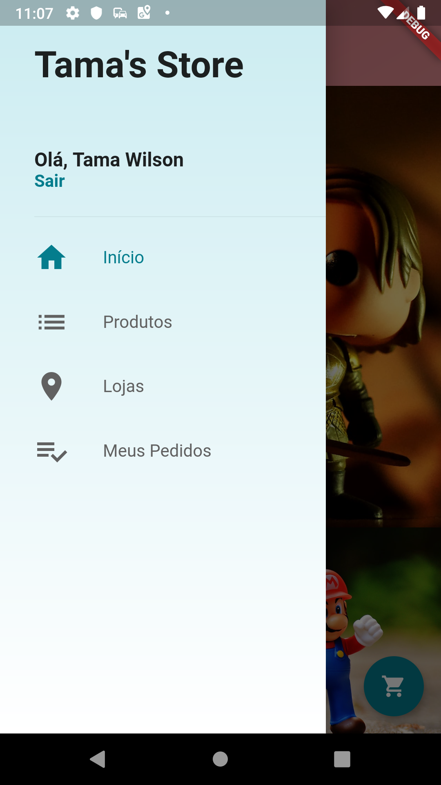
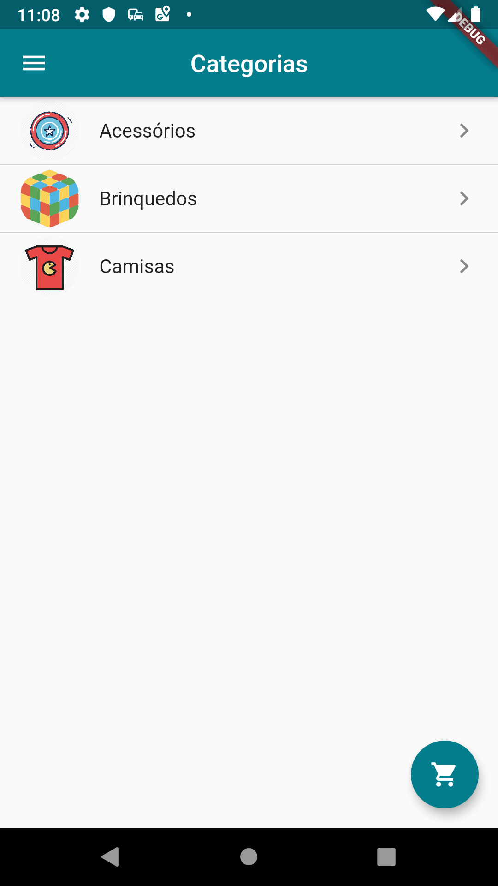
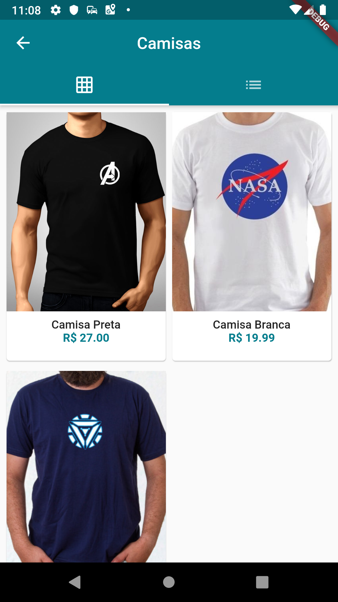
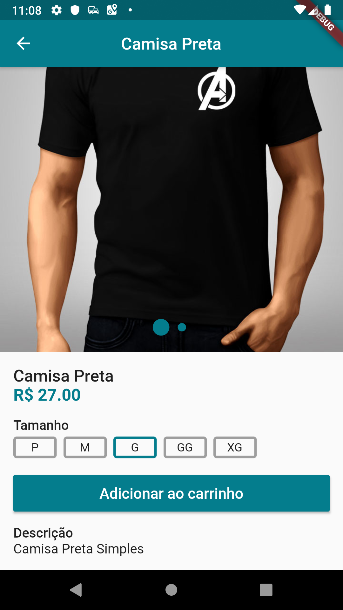
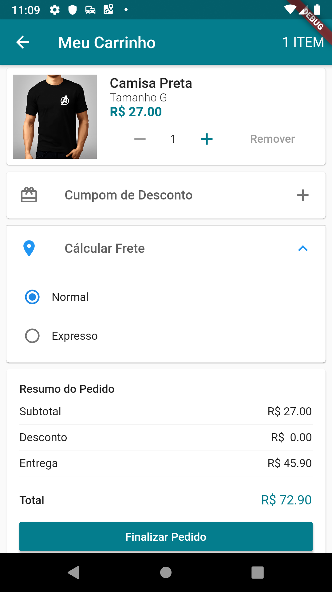
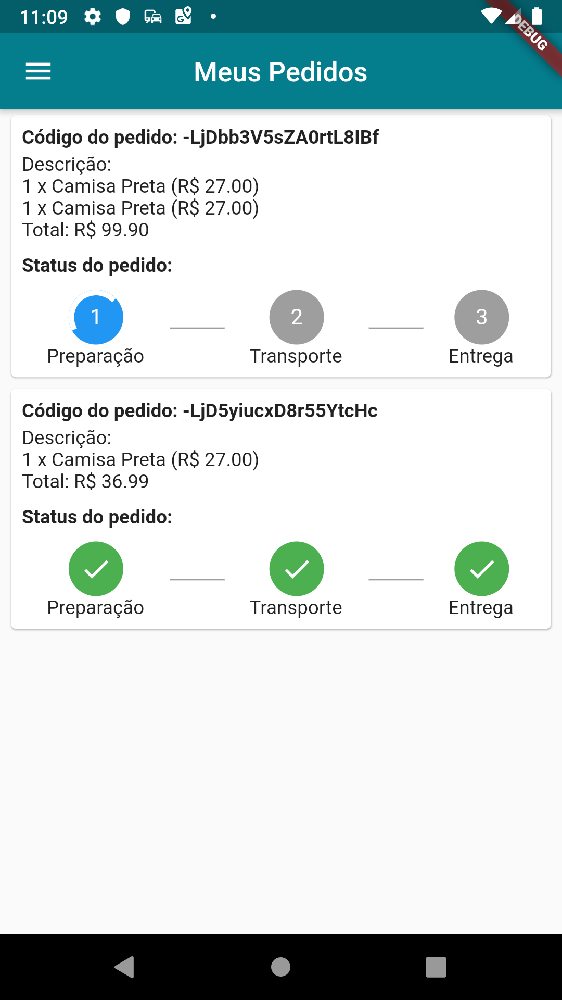

# Loja Virtual

Projeto 8 do curso [Criação de Apps Android e iOS com Flutter](https://www.udemy.com/curso-completo-flutter-app-android-ios/)

# Adições originais

- Cálculo de frete baseado no CEP do usuário (API disponibilizada no Q&A do curso).
- Usuário deve informar o CEP no cadastro
- Card do CEP utilizando widgets de Radio

 

 

